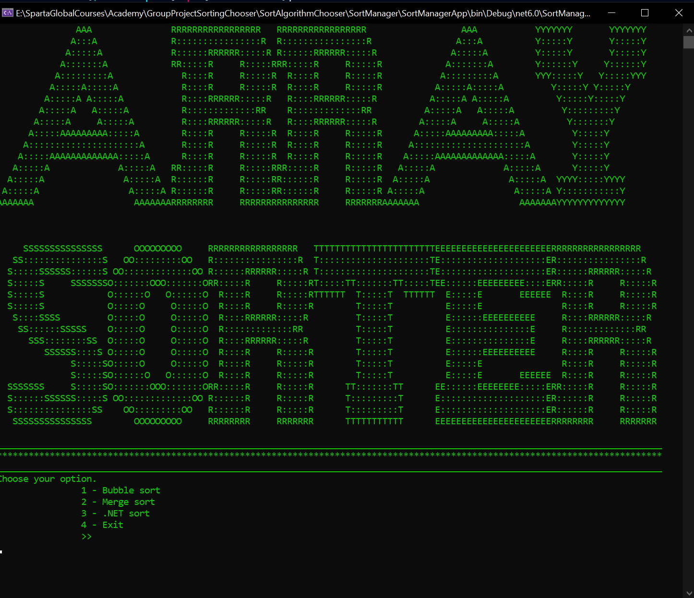
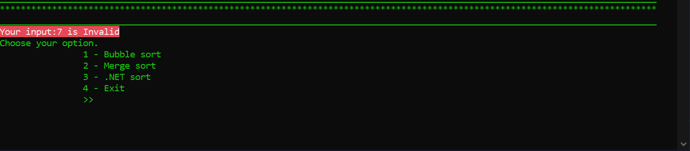
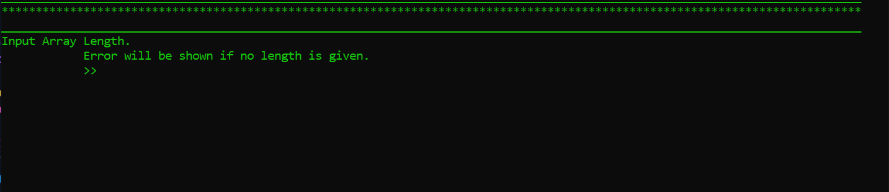
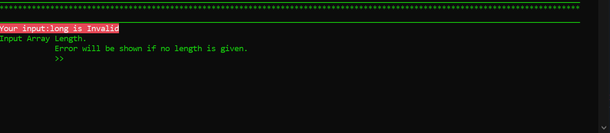
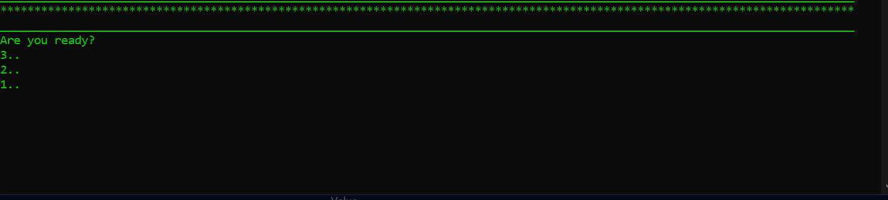
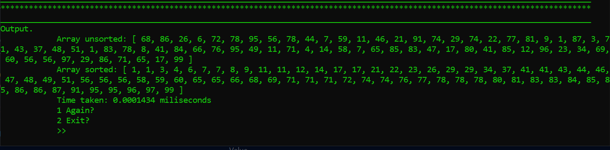

# SortAlgorithmChooser

[](https://github.com/greezyBob/SortAlgorithmChooser/actions/workflows/dotnet.yml)
[](https://coveralls.io/github/greezyBob/SortAlgorithmChooser?branch=main)


## Table Of Contents

1. [About The Project](#about-the-project)
    1. [Built With](#built-with)
2. [Getting Started](#getting-started)
    1. [Prerequisites](#prerequisites)
    2. [Installation](#installation)
3. [Usage](#usage)
4. [Sorting Algorithms](#sorting-algorithms)
5. [Contributors](#contributors)
  
 # About The Project
 
The sort manager is a console application that conforms to the MVC architecture and provides a basic interface for the purpose of displaying the effectiveness of each sorting algorithm. The user can choose the type of sorting algoritm, for example Merge sort, the length of the array, sorts the array in ascending order and displays the results on screen along with the timer to show the speed of the algorithm.

### Built With

- This application is built using .Net 6 and C#.

---
## Getting Started

### Prerequisites

- We recommend having the latest Visual Studio installed as well as C#.

### Installation

To get started with this project: 

Clone the repo
```
git clone https://github.com/greezyBob/SortAlgorithmChooser.git
```  
---
## Usage

* The opening screen displays the animated ASCII title followed by a selection menu for sort methods



* Decision is given via the command line Console.ReadLine()

* If a user enters an invalid character, an error message will be thrown and they will be prompted to re-enter an option



* A valid input yields an array length input screen



* Here, just as in the primary sort method selection screen, an invalid input prompts re-entry



* On valid entry of an array length, the user is held in tangible suspense as the app initiates a countdown



* The program should then output:
    1. The unsorted randomly generated array
    2. The algorithm to be used
    3. The sorted array after the algorithm has been executed
    4. Time taken



* A user is then prompted as to whether they would like to use the application again. If so, the application begins again from the primary animation

---

## Sorting Algorithms

### Bubble Sort

Bubble sort is the simplest sorting algorithm used in the Sort Manager. It is also the slowest because it steps through every element and swaps the next element with the previous if the next one is less than the previous. This sequence is repeated for the number of elements in the array i.e. if there are 10 elements in the array, the sequence will need 100 steps or 10<sup>2</sup>. This is also written as O(n<sup>2</sup>) using big-o notation.

<a href="https://en.wikipedia.org/wiki/Bubble_sort#/media/File:Bubble-sort-example-300px.gif"> Bubble Sort Demo</a>


### Merge Sort

Merge sort uses the divide and conquer method to sort the array by dividing it in half until each sub array has one element and then recombining these sub arrays in order. The steps are as follows: begin by dividing the array in two roughly equal parts and then recursively calling itself with each of those arrays. Continue the recursive decomposition of the array until the base case of the recursion is reached, where the list is divided into arrays of length one, which are by definition sorted. Then, as control passes back up the recursive calling structure, the algorithm merges into one sorted array the two sorted sub arrays resulting from the two recursive calls. Merge sort is faster than bubble sort and has a big-o of O(nlog(n)).

<a href="https://en.wikipedia.org/wiki/Merge_sort#/media/File:Merge-sort-example-300px.gif"> Merge Sort Demo</a>

### .Net Sort

The .Net sorting algorithm uses a number of different sorting algorithms depending on the size of the array to be sorted.
1. If the size is fewer than 16 elements, it uses an insertion sort algorithm.
2. If the size exceeds 2 * log^N, where N is the range of the input array, it uses a Heap Sort algorithm.
3. Otherwise, it uses a Quicksort algorithm.

---
### Contributors

- Robert Green(Scrum Master)
- Mark Pollard
- Michael Bonardi Davies
- Ameer Imam Al-Murtaza Gardezi
- Rahul Patel
- Jai Bharat Kothari
